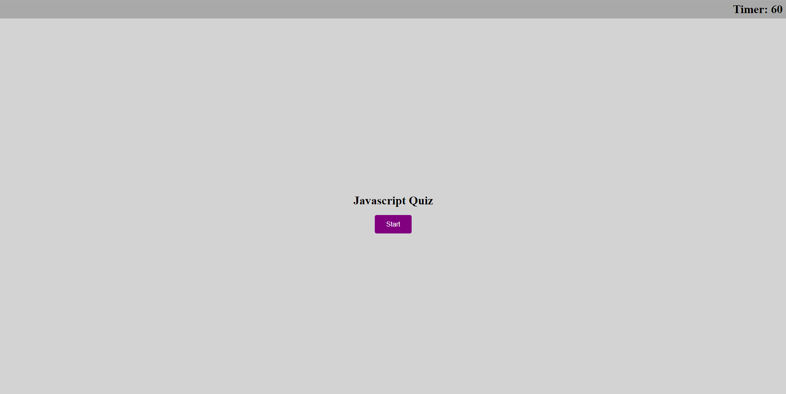
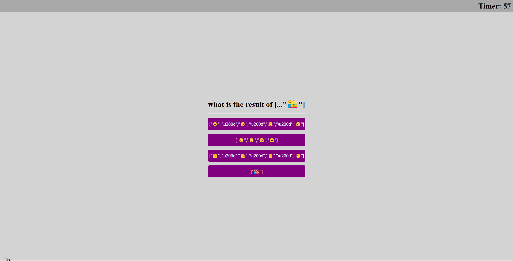
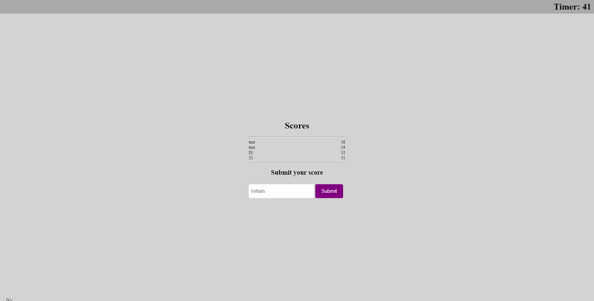

# Javascript Quiz

Deployed on github pages, you can view it [here](https://ianssenne.github.io/ch-js-quiz/)

## Objective

To create a quiz that shows off some of the wierd Javascript knowledge I have obtained.

## Technologies Used

| name       | usage                                       |
| :--------- | :------------------------------------------ |
| javascript | used for implimentation of the page logic   |
| css        | used for styling the page                   |
| html       | used for defining the structure of the page |
| prettier   | used for formatting of files                |

## The Final Version of the Javascript Quiz Website

## features

- start quiz screen
- timer
- questions with penalty for being incorrect
- local high score using `localStorage`
